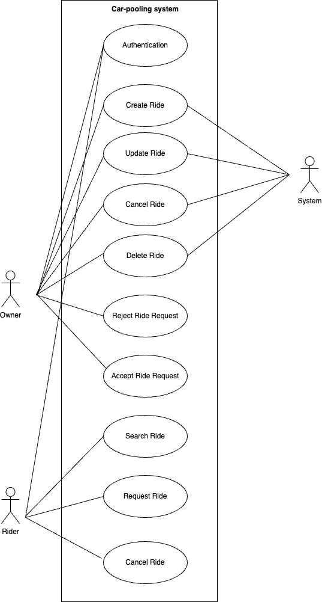

<h2>Rydex - Connecting Riders, Reducing Commutes</h2>

[](https://github.com/ABPAB/peer-to-peer-carpooling/blob/main/LICENSE)
[](https://nodejs.org/en/about)
[](https://expressjs.com/en/starter/installing.html)
[](https://dev.mysql.com/doc/)
[](https://docs.spring.io/spring-boot/documentation.html)

**Rydex** is a `blockchain-powered` peer-to-peer ride sharing platform that revolutionizes the way we travel. By leveraging `smart-contracts`, we eliminate the need for intermediaries, ensuring secure, transparent, and efficient transactions. Our system empowers users to directly connect with each other, book rides, and make payments, all while maintaining privacy and control over their data.

### Objectives

- **Reduced Fees**: Eliminates intermediaries, reducing transaction fees and increasing earnings for drivers.
- **Enhanced Security and Privacy**: Enhances security and privacy through cryptographic techniques and decentralized data storage.
- **Increased Transparency**: Provides transparency in ride history, ratings, and payment transactions.
 

<h2>API Documentation</h2>

[](https://app.swaggerhub.com/apis/2023SL93036/CarPooling/1.0.0#/info)
[](https://app.swaggerhub.com/apis/2023SL93036/carpooling-ride-search-service/1.0.0)

## **Stakeholders**

### `Owners`

Car owners offering available seats for upcoming rides.

**Goals:**

- Set ride details: `source`, `destination`, `ride-status`, `scheduled-date`, `departure-time` and `available-seats`.
- Accept or reject ride requests from riders.
- Cancel/Delete ride.
- View list of confirmed riders for their rides.

### **`Riders`**

Individuals seeking rides along specific routes.

**Goals:**

- Search and filter rides based on preferred routes.
- Request seats in a driver's carpool.
- Cancel a ride.

<h2>Use Case Diagram</h2>

<div align="center">
  
</div>

### 1. Authentication

**Description**: Ensures that only authorized users can access the system.

**Actors**: Owner, Rider, System.

**Steps**:

- User enters their credentials (username and password).
- The system verifies the credentials.
- Access is granted upon successful verification.
  
**Example**:
A rider logs into the system to book a ride using their email and password.

### 2. Create Ride

**Description**: Allows the owner to create a new ride entry.

**Actors**: Owner, System.

**Steps**:

- The owner specifies ride details (pickup location, destination, date, time, available seats).
- The system saves the ride details in the database.
  
**Example:**
An owner creates a ride from "Point A" to "Point B" on 1st Dec at 10:00 AM, offering 3 seats.

### 3. Update Ride

**Description**: Enables the owner to modify details of an existing ride.

**Actors**: Owner, System.

**Steps**:

- The owner selects a ride from their list.
- Updates are made (e.g., time, route, or seats).
- The system saves the changes.
  
**Example**:
The owner changes the departure time of a ride from 10:00 AM to 11:00 AM.

### 4. Cancel Ride

**Description**: Allows the owner to cancel a scheduled ride.

**Actors**: Owner, System.

**Steps**:

- The owner selects a ride to cancel.
- The system marks the ride as canceled and notifies the riders.
  
**Example**:
The owner cancels a ride due to unforeseen circumstances, and riders are informed via notifications.

### 5. Delete Ride

**Description**: Permits the owner to remove a ride permanently.

**Actors**: Owner, System.

**Steps**:

- The owner selects a ride to delete.
- The system removes the ride record.
  
**Example:**
An owner deletes an outdated ride entry to avoid clutter in their dashboard.

### 6. Reject Ride Request

**Description**: Allows the owner to reject a rider's request for a seat in their ride.

**Actors**: Owner, Rider, System.

**Steps**:

- The owner views pending ride requests.
- Rejects a request, specifying a reason if needed.
- The system notifies the rider about the rejection.
  
**Example:**
The owner rejects a request due to unavailability of seats.

### 7. Accept Ride Request

**Description**: Enables the owner to approve a rider's request to join their ride.

**Actors**: Owner, Rider, System.

**Steps**:

- The owner reviews a rider's request.
- Approves the request.
- The system confirms the seat for the rider.
  
**Example**:
The owner accepts a rider's request to join a ride from "Point A" to "Point B."

### 8. Search Ride

**Description**: Allows riders to search for available rides matching their criteria.

**Actors**: Rider, System.

**Steps**:

- The rider inputs search criteria (pickup, destination, date).
- The system displays matching rides.
  
**Example**:
A rider searches for rides from "Point A" to "Point B" on 1st Dec.

### 9. Request Ride

**Description**: Enables riders to request a seat in an available ride.

**Actors**: Rider, Owner, System.

**Steps**:

- The rider selects a ride from the search results.
- Sends a request to the owner.
- The system notifies the owner about the new request.
  
**Example**:
A rider requests to join a ride from "Point A" to "Point B," specifying a seat requirement.

### 10. Cancel Ride Request

**Description**: Allows riders to cancel a previously sent ride request.

**Actors**: Rider, Owner, System.

**Steps**:

- The rider selects the sent request.
- Cancels the request.
- The system notifies the owner.
  
**Example**:
A rider cancels their request after finding another suitable ride.


  
## **Tech Stack**

- **Node.js**: Backend server handling ride data, user authentication, and ride coordination.
- **Express.js**: Framework for building robust REST APIs.
- **MySQL**: To store user and ride data.
- **Kafka**: To emit and consume events.
- **Spring-boot**: For implementing the business-logic.
- **Firebase Cloud Messaging (FCM)**: Sends real-time notifications for ride updates and booking statuses.
  
# **Modules**

**1. User Authentication**

- Sign-up and login functionality.
    
**2. Ride Management**

Owners can:
- Add, edit, and delete rides.
- View and manage ride requests.
  
Riders can:
- Browse, request, and track ride bookings.
  
**3. Notifications**

Push notifications for:
- Owners: Booking requests and rider cancellations.
- Riders: Booking approvals or rejections, and ride updates.

**3. Service Discovery**

- Allows service instances to register themselves and facilitate service-discovery

**4. Location service (Future Scope)**

- Real-time location of owners and riders.

**4. Payment System (Future Scope)**

- Integration of payment gateways to facilitate fare sharing.

# **Setup Instructions**

## **Prerequisites**

- Node.js (v14 or higher)
- MongoDB
- Firebase account for FCM
  
### **1. Clone the Repository**

```
git clone https://github.com/ABPAB/peer-to-peer-carpooling.git

cd peer-to-peer-carpooling
```

### **2. Install Dependencies**

```
npm install
```
### **3. Configure Environment Variables**

Create a `.env` file in the project root and add the following variables:

```
PORT=3000
MONGO_URI=mongodb://localhost:27017/peer-to-peer-carpooling
FIREBASE_API_KEY=your_firebase_api_key
```

### **4. Run the Application**

```
npm start
```

### **5. Access the Application**

Open your browser and navigate to:

```
http://localhost:3000
```

## **Future Enhancements**

- Integration with payment gateways for in-app fare handling.
- Advanced search with AI-driven route suggestions.
- Ride safety features, including driver verification and ride tracking.
- Integration with Google Maps for better route visualization.
  
## **Contributing**

We welcome contributions to enhance the Peer-to-Peer Carpooling platform! To contribute:

1. Fork the repository.

2. Create a feature branch:

```
git checkout -b feature-name
```

3. Commit your changes:

```
git commit -m "Add feature-name"
```

4. Push to your branch:

```
git push origin feature-name
```
5. Create a pull request.
  
## **License**

This project is licensed under the MIT License. See the `LICENSE` file for details.

## **Contact**

For queries or suggestions, please contact the project maintainers:

**Email**: kpkumar.8757@gmail.com

**GitHub Issues**: [Create an issue](https://github.com/ABPAB/peer-to-peer-carpooling/issues)

<div align="center">
  
## **Team Members**

| Name                         | Roll Number   |
|------------------------------|---------------|
| **Pragati Upadhyay**          | 2023SL93036   |
| **Harsh Vardhan Srivastava**  | 2023SL93015   |
| **Gayatri Deshmukh**          | 2023SL93091   |
| **Pawan Mehta**               | 2023SL93046   |
| **Gopal Anand**               | 2023SL93044   |
</div>


